LAB DE CI E CD -- GITLAB E JENKINS
----------------------------------

Sumário 
=======

[Introdução](#introdução)

[Docker Compose](#docker-compose)

[Serviços](#serviços)

[Jenkins](#jenkins)

[GitLab](#gitlab)

[3. Subindo o ambiente](#subindo-o-ambiente)

[Iniciando os serviços](#iniciando-os-serviços)

[a. Configurando Jenkins](#configurando-jenkins)

[b. Configurando GitLab](#configurando-gitlab)

[c. Criação do repositório no gitlab](#criação-do-repositório-no-gitlab)

[d. Criando access token no gitlab](#criando-access-token-no-gitlab)

[e. Adicionando a credencial no Jenkins](#adicionando-a-credencial-no-jenkins)

[f. Configurando a conexão Gitlab x Jenkins](#configurando-a-conexão-gitlab-x-jenkins)

[g. Criação do Job no Jenkins](#criação-do-job-no-jenkins)

[h. Criando Webhook gitlab](#criando-webhook-gitlab)

[i. Testando o pipeline](#testando-o-pipeline)

Introdução
----------

> Nesse lab vamos aprender a instalar e configurar o gitlab e o Jenkins.
> Além disso vamos criar um job de build no Jenkins disparado quando
> temos um evento em um repositorio do gitlab.

Docker Compose
--------------

> Para isso, vamos criar um arquivo *docker-compose.yml* na pasta de sua
> preferência e copiar todo o conteúdo abaixo para dentro dele.
>
> <https://github.com/daniboy82/gitlab-jenkins>

```
version: '2'
 
services:
    jenkins:
      image: Jenkins/jenkins
      container_name: jenkins
      hostname: jenkins01
      network_mode: "bridge"
      ports:
        - "8080:8080"
        - "50000:50000"
      volumes:
        - ~/Projects/jenkins_home:/var/jenkins_home
 
    gitlab:
        image: gitlab/gitlab-ce
        container_name: gitlab
        hostname: gitlab
        restart: always
        network_mode: bridge
        ports:
           - "443:443"
           - "8050:80"
           - "2222:22"
        # volumes:
        #  - ~/Projects/gitlab/config:/etc/gitlab
        #  - ~/Projects/gitlab/logs:/var/log/gitlab
        #  - ~/Projects/gitlab/data:/var/opt/gitlab
```


### Serviços

> Antes de prosseguir com o projeto, segue uma breve explicação sobre
> cada serviço que estamos subindo. Voltaremos com a programação normal
> em seguida, nesse mesmo canal e nesse mesmo horário.

### Jenkins

> O [Jenkins](https://jenkins.io/) permite a automação dos
> processos no nosso projeto. Podemos automatizar testes, builds etc,
> escolhendo quais serão as ações que vão acionar nosso *Job*.
>
> Vamos ver mais sobre essa integração ainda neste artigo.

### GitLab

> O Gitlab vai ser o nosso gerenciador de repositório. Ele é muito
> parecido com o [GitHub](https://github.com/), mas com a
> vantagem de podermos subir o serviço localmente. Além disso, a
> integração dele com o Jenkins é muito grande (aliás, esse é o
> propósito deste artigo). Por meio de um WebHook vamos conseguir a
> comunicação direta com o Jenkins, eliminando a necessidade de ele
> ficar checando o repositório constantemente. O GitLab vai informar ao
> Jenkins quando um evento ocorre (um *Merge Request* de uma *feature
> branch* na *branch Develop*, por exemplo) e com isso um Job ligado ao
> Jenkins pelo WebHook é iniciado.

Subindo o ambiente
------------------

### 

### Iniciando os serviços

> No diretório em que você criou o arquivo docker-compose.yml, execute o
> comando:
>
> \#docker-compose up -d

Configurando Jenkins
--------------------

> Após a inicialização dos serviços com o docker-compose, vamos fazer a
> configuração inicial do Jenkins. Acesse a url <http://ip:8080/> e você
> será direcionado para a página inicial da ferramenta.
>
> 
>
> Para configurá-lo, vamos inserir a chave que ele gerou no momento da
> instalação. Existem duas maneiras de encontrar a chave, a mais simples
> é digitar no terminal *docker logs -f jenkins*. Ele vai exibir assim:
>
> 
>
> Há outro modo, que é acessando a
> pasta */var/jenkins\_home/secrets/initialAdminPassword*.
>
> Após colocar a senha inicial, o Jenkins vai exibir a página de
> customização dos plugins iniciais. Selecione Install sugested plugins
> e aguarde o download e instalação.
>
> 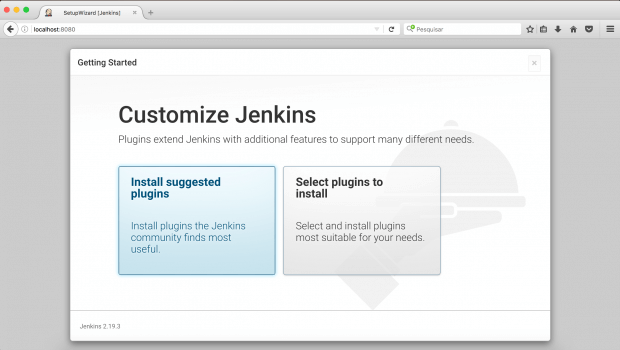
>
> Pronto, o Jenkins já está pronto para ser utilizado!

Configurando GitLab
-------------------

> Com o GitLab, o processo é bem mais simples. É só acessar a página
> inicial dele <http://ip:8050/> e colocar uma senha com no mínimo
> oito caracteres.
>
> 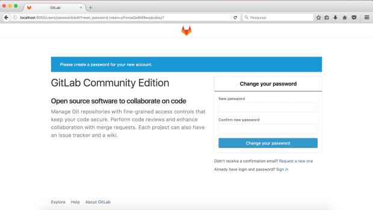
>
> Agora estamos com o ambiente pronto e podemos começar a configuração
> da integração. Segura, que o filho é seu!

Criação do repositório no gitlab
--------------------------------

> Vamos criar um repositório no Gitlab para armazenar nosso projeto (são
> só dois arquivos, mas faz de conta que é um projeto).
>
> Na tela inicial, clique em *New Project*, preencha o nome para seu
> projeto e clique em *Create Project*.
>
> 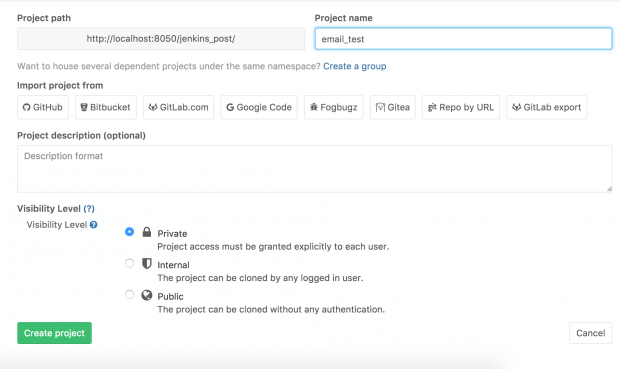
>
> Agora, vamos adicionar os dois arquivos para execução de um teste
> unitário em Python.
>
> O primeiro faz uma validação muito simples de e-mail, apenas para esse
> exemplo. Ele recebe um e-mail e retorna se é verdadeiro ou falso se
> houver um @.
>
> *mail.py*

```python
  def is_valid(email):
  return email and '@' in email
```

> O segundo arquivo serve para automatizar o teste e facilitar nossa
> vida (é para isso que estamos aqui).
>
> *mail\_test.py*

```python
import unittest
import mail
class MailTest(unittest.TestCase):
  def test_should_return_true_when_email_is_valid(self):
      self.assertTrue(mail.is_valid('daniel.lemes@alumni.usp.br'))
  def test_should_return_false_when_email_is_invalid(self):
      self.assertFalse(mail.is_valid('xxxxx'))
if __name__ == '__main__':
  unittest.main()
```

Instalando plugin do gitlab no jenkins
------------------------------

> Vamos precisar do [[GitLab
> Plugin]](https://wiki.jenkins-ci.org/display/JENKINS/GitLab+Plugin) para
> nos conectarmos ao repositório do projeto (lembre-se: são só dois
> arquivos, mas vamos manter a positividade). Para instalar, vá até
> \[Gerenciar Jenkins\]-\>\[Gerenciar Plugins\] e clique na
> aba *Disponíveis*.
>
> Com o plugin instalado, vamos adicionar uma conexão com o GitLab,
> seguir alguns passos simples.
>
> **Criando um access token**
>
> Clique no círculo com sua imagem de perfil, que fica no canto superior
> direito, e vá em *Profile Settings*. Clique na aba *Access Tokens*.
> Digite um nome fácil de identificar para seu token e clique em *Create
> Personal Access Token*.
>
> 
>
> Após a criação, copie o hash exibido na tela, porque vamos usá-lo no
> próximo passo.
>
> 
>
> O token desaparece após atualizar a página, então, guarde em um lugar
> seguro.

Adicionando a credencial no Jenkins
-----------------------------------

> Na tela inicial do Jenkins, vá até Credentials. Clique na seta do lado
> de global e selecione *Add Credentials*.
>
> 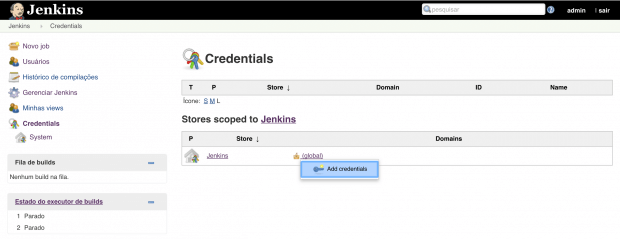
>
> Na janela a seguir, selecione *GitLab API Token* e coloque o hash
> gerado no GitLab no campo API token.
>
> 
>
> Após clicar em OK, você verá sua credencial criada.
>
> 

Configurando a conexão Gitlab x Jenkins
---------------------------------------

> Com a nossa credencial criada, vamos em \[Gerenciar
> Jenkins\]-\>\[Configurar o sistema\]. Desça até a Gitlab e preencha as
> informações conforme a imagem abaixo. Ao terminar, clique em *Test
> Connection*. Se tudo estiver certo, clique em *Salvar*.
>
> 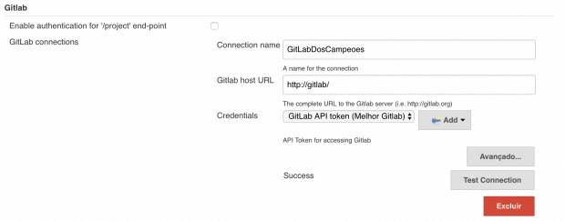
>
> 
>
> Depois de tantas configurações, vamos em frente!

Criação do Job no Jenkins
-------------------------

> No canto esquerdo, clique em *Novo Job*, escolha *Projeto Freestyle*,
> digite um nome para o Job e clique em *OK*.
>
> 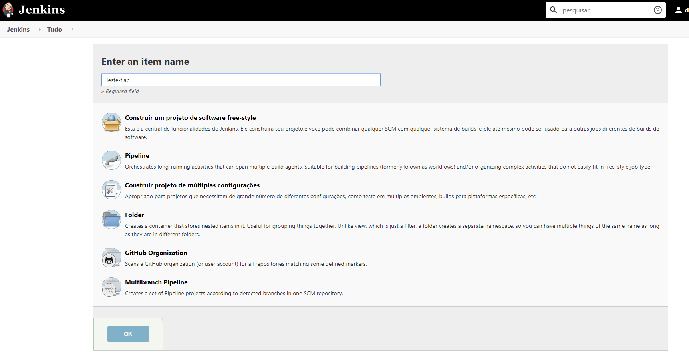
>
> Com o Job criado, vamos às configurações.
>
> **General**
>
> Adicione a conexão que criamos no campo *GitLab Connection*.
>
> 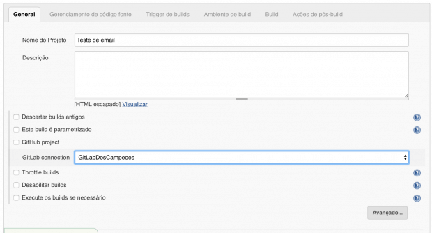
>
> **Gerenciamento de código fonte**
>
> Selecione a opção Git e adicione as informações do repositório criado
> no GitLab.
>
> 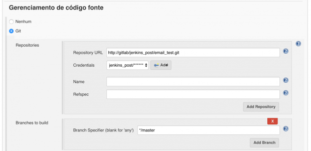
>
> Para adicionar as credencias válidas para o repositório, clique em
> \[Add\]-\>\[Jenkins\] e adicione um usuário e senha válidos para
> conexão.
>
> 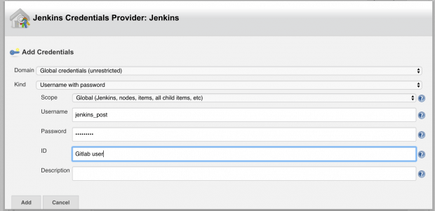
>
> **Trigger de Builds**
>
> Esse é o primeiro passo para nossa integração entre os dois serviços.
> Estamos quase lá!
>
> Marque a opção *Build when a change is pushed to GitLab* e selecione
> quais ações executadas no GitLab vão acionar o Job no Jenkins. Copie a
> URL logo após a frase *GitLab CI Service URL*, pois vamos usá-la mais
> pra frente.
>
> 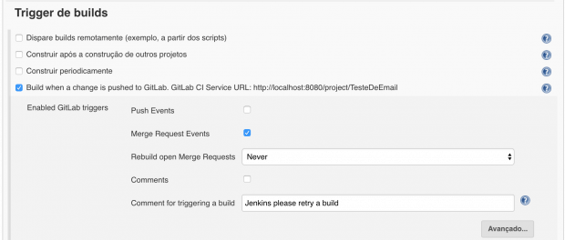
>
> **Build**
>
> Adicione um passo no build com a opção *Executar shell* e adicione o
> código *python mail\_test.py*. Com isso, os testes que foram
> adicionados ao repositório serão executados pelo Jenkins.
>
> 
>
> **Ações de pós-build**
>
> Selecione a opção *Publish build status to GitLab commit*. Agora o
> Jenkins colocará o feedback de cada build nos commits/merges que
> acionaram o Job.
>
> 
>
> Clique em Salvar e o Job está finalizado.

Criando Webhook gitlab
----------------------

> Como último passo, vamos adicionar o Webhook em nosso repositório no
> GitLab. Ele vai fornecer as informações para o Jenkins quando houver
> alguma alteração ou ação no repositório no qual ele foi configurado.
>
> Na página inicial do repositório, clique na engrenagem no canto
> superior direito e selecione *Webhooks.*
>
> 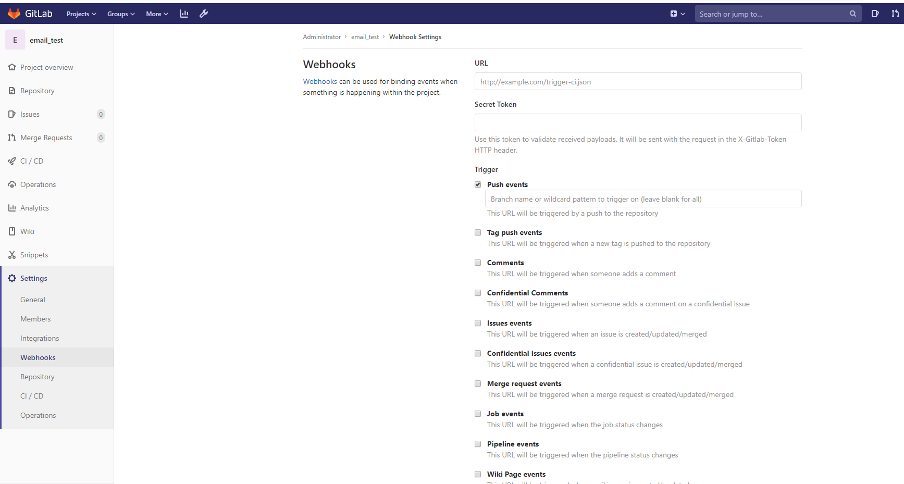
>
> Cole a URL que o Jenkins forneceu no campo URL e substitua localhost
> por Jenkins. Selecione as ações que vão acionar o webhook e clique
> em *Add Webhook.*
>
> 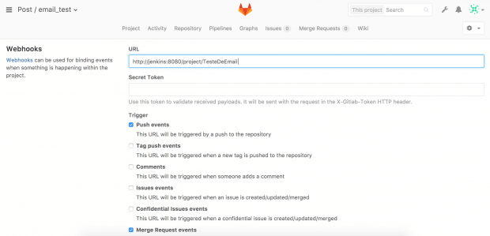
>
> 

Testando o pipeline
-------------------

> Após tantos passos e configurações, vamos ver nosso projeto rodando.
> Abra um merge request ou faça um commit/push para o repositório criado
> do gitlab e aguarde o Job ser iniciado. Ao finalizar, ele vai
> adicionar ao GitLab o feedback do build realizado com as alterações
> que foram feitas no código. Com isso seu projeto ganha muito mais
> agilidade e confiabilidade, com testes e feedbacks rápidos e
> automatizados.
>
> 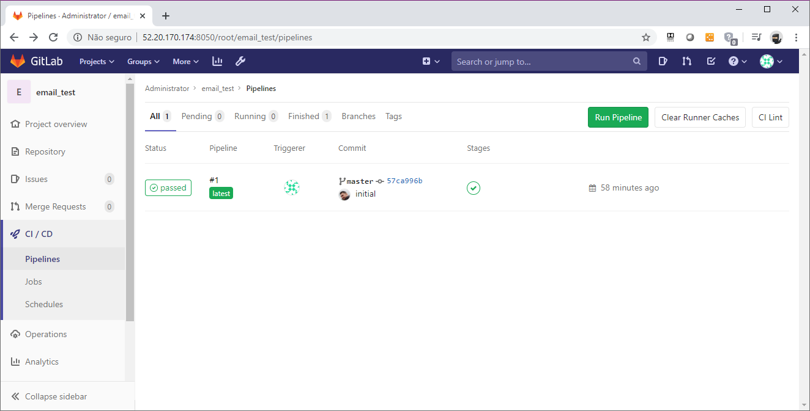
>
> Figura 1 menu pipeline do repositório
>
> Referências:
>
> <https://imasters.com.br/devsecops/gitlab-jenkins-uma-integracao-poderosa>
